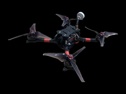

# Emax Hawk 5

5-inch freestyle quad (Emax Magnum Omnibus F4 · Betaflight **3.2.2**) for the TX16S MK3.

**Full multirotor model** — structured like your existing **AERO** (`model1.yml`): direct switch→channel mixes, Outputs-first screens, no heli/swash. Switch *habits* match the helis (SA–SF). **Up = safer / more level**; labels are Up/Mid/Down.

| | |
|--|--|
| **Model file** | `model6.yml` · **Emax Hawk 5** |
| **Reference style** | Radio `model1` **AERO** (not HBK2) |
| **Type** | Airplane/multirotor · heli disabled · no custom ±200% limits |
| **RF** | **External** MULTI · AFHDS 2A · PPM_IBUS · 10 ch |
| **Inputs** | **Roll / Pitch / Thr / Yaw** (AETR) |
| **AUX** | SE→CH5 · SF→CH6 · SH→CH7 · SA→CH8 · SB→CH9 · SW1→CH10 |

Previously flown on a Turnigy **FS-MT6**.

## Important

Your current Betaflight AUX map does **not** match this radio pack. After bind, paste the CLI from [betaflight-modes.md](betaflight-modes.md) (or set Modes in an older Configurator).

## Docs

| Doc | What |
|-----|------|
| [RESTORE.md](RESTORE.md) | Drop SD pack onto the radio |
| [SETUP.md](SETUP.md) | Cheat sheet |
| [switch-map.md](switch-map.md) | Switches & sticks |
| [betaflight-modes.md](betaflight-modes.md) | AUX rematch for BF 3.2.2 |
| [rf-and-binding.md](rf-and-binding.md) | Bind / failsafe |
| [changelog.md](changelog.md) | Pack history |

## SD pack

[`../SD Card Files/`](../SD%20Card%20Files/)
