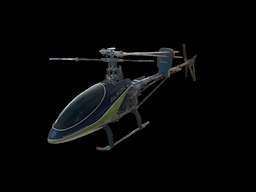

# Align 450 SE V2

**Flybar Align T-Rex 450 SE V2** programmed on a Radiomaster **TX16S MK3** (EdgeTX), bound to a Spektrum **AR6200**.

This folder is the model’s documentation hub: how the radio is set up, how to fly the modes, how we levelled and tuned it, and how to restore the SD card backup.

---

## At a glance

| Item | Detail |
|------|--------|
| Airframe | Align 450 SE V2 (flybar, CCPM 120°) |
| Transmitter | TX16S MK3 · EdgeTX |
| Receiver | Spektrum AR6200 (6ch) |
| Flight modes | Normal · Idle-Up 1 · Idle-Up 2 (**SE**) |
| Rates | Low · Medium · High (**SC**) |
| Hold | Throttle hold (**SF**) |
| Gyro gain | **SA** → GEAR |
| Lights | **SB** (RGB LED scripts) |
| Timer | **SD** |
| Pack | **3S** for flight · 2S OK for bench tune only |

---

## Documentation map

### Start here
| Doc | What’s in it |
|-----|----------------|
| **[Restore SD card files](RESTORE.md)** | Drop the backup onto the TX SD so the model loads |
| **[Switch map & keybinds](switch-map.md)** | Every switch and what it does |
| **[How to fly this model](flying-guide.md)** | Spool-up, hover, Idle-Up, safety order |

### Radio setup (what we programmed)
| Doc | What’s in it |
|-----|----------------|
| **[Flight modes, throttle & pitch curves](flight-modes-and-curves.md)** | Normal / Idle1 / Idle2 and the curve tables |
| **[Dual rates & expo](dual-rates-and-expo.md)** | Why cyclic felt sharp; Low/Med/High rates |
| **[EdgeTX programming walkthrough](edgetx-programming.md)** | Flight modes → Inputs → Mixers → Heli PIT/CYC3 |
| **[AR6200 wiring](ar6200-wiring.md)** | Port-by-port CCPM map |

### Mechanics & tuning (what we did on the heli)
| Doc | What’s in it |
|-----|----------------|
| **[Swashplate levelling](swashplate-leveling.md)** | Leveler tool, mid-stick, next steps |
| **[Yaw, gyro & heading hold](yaw-gyro-heading-hold.md)** | Runaway spin, HH vs rate, sense check |
| **[Battery notes](battery-notes.md)** | 3S vs 2S for flying vs tuning |

### Reference
| Doc | What’s in it |
|-----|----------------|
| **[Setup summary](SETUP.md)** | Compact cheat sheet of the finished setup |
| **[Troubleshooting](troubleshooting.md)** | Common symptoms → what to change |
| **[Session changelog](changelog.md)** | What we fixed and decided in order |

---

## SD card backup

Droppable EdgeTX layout (merge onto SD root):

[`../SD Card Files/`](../SD%20Card%20Files/)

Includes `MODELS/model3.yml`, bitmap, and RGBLED scripts used by **SB**. Screen gauges use built-in EdgeTX widgets.

---

## Safety reminders

1. **SF hold ON** until ready to spool.  
2. Take off and land in **Normal** + **Low rates**.  
3. Never flip Idle-Up from zero head speed with collective up.  
4. Big cyclic trim → fix swash geometry, don’t stack radio trim.  
5. Violent yaw either way → gyro **sense**, not gain chasing.

---

[← Back to repo home](../../../README.md)
