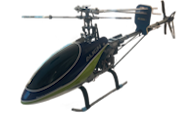

# Switch map & keybinds

Physical controls on the TX16S for **Align 450 SE V2**.

## Switches

| Switch | Function | Positions (typical) |
|--------|----------|---------------------|
| **SF** | **Throttle hold** | ON = motor channel forced safe (override) |
| **SE** | **Flight mode** | ↑ Normal (`SE0`) · − Idle1 (`SE1`) · ↓ Idle2 (`SE2`) |
| **SA** | **Gyro gain** | 3-pos HH / rate values as tuned |
| **SB** | **RGB lights** | **SB0** `srain` ∑ **SB1** `sapp` ∑ **SB2** `off` ∑ **S1** bri ∑ **S2** spd |
| **SC** | **Dual rates** | ↑ Low (`SC0`) · − Medium (`SC1`) · ↓ High (`SC2`) — screen: `SC - Rates Low/Mid/High` |
| **SD** | **Flight timer** | Starts / controls the Flight timer |

Confirm live labels on your radio if you remapped anything after this backup.

## Sticks

| Stick | Controls |
|-------|----------|
| Collective / throttle (left, Mode 2) | Head speed + collective pitch (via thr/pitch curves) |
| Rudder (left yaw) | Tail (through gyro) |
| Elevator (right fore/aft) | Cyclic pitch |
| Aileron (right left/right) | Cyclic roll |

## Recommended “default” before spool

| Control | Set to |
|---------|--------|
| **SF** | Hold **ON** |
| **SE** | **Normal** |
| **SC** | **Low** rates |
| **SA** | Moderate **positive HH** gain (not max) |
| Collective | Low / idle |

## Related

- [How to fly](flying-guide.md)
- [Flight modes & curves](flight-modes-and-curves.md)
- [Dual rates & expo](dual-rates-and-expo.md)
- [‚Üê Model home](README.md)
