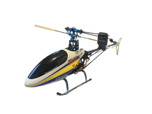

# Switch map & keybinds

Physical controls on the TX16S for **Align 450 XL** (independent roll / elevate / pitch servos).

## Switches

| Switch | Function | Positions (typical) |
|--------|----------|---------------------|
| **SF** | **Throttle hold** | ON = motor channel forced safe |
| **SE** | **Flight mode** | Down Normal � Mid Idle1 � Up Idle2 |
| **SA** | **Gyro gain** | ? CH5 **Gain** (if wired) |
| **SB** | **RGB lights** | Up `srain` � Mid `sapp` � Down `off` |
| **SC** | **Dual rates** | Low � Medium � High (Ail/Ele/Rud) |
| **SD** | **Flight timer** | Flight timer |

## Sticks ? outputs

| Stick | Input | Output CH | Label |
|-------|--------|-----------|--------|
| Throttle / collective | Thr + Pit curves | **CH1** Motor � **CH3** Elevate | Head speed + swash height |
| Aileron | Ail | **CH2** Roll | Roll servo only |
| Elevator | Ele | **CH6** Pitch | Fore/aft servo only |
| Rudder | Rud | **CH4** Rud | Tail gyro |

## Recommended default before spool

| Control | Set to |
|---------|--------|
| **SF** | Hold **ON** |
| **SE** | **Normal** |
| **SC** | **Low** |
| Collective | Low / idle |

## Related

- [Setup](SETUP.md)
- [R86C wiring](r86c-wiring.md)
- [? Model home](README.md)
