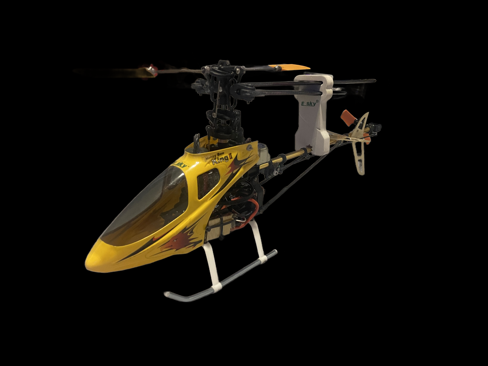

# Honey Bee King 2

**E-Sky Honey Bee King 2** (flybar CCPM) programmed on a Radiomaster **TX16S MK3** (EdgeTX) as model **Esky HBK 2**, bound to a RadioMaster **R86C**.

Cloned from the Align 450 SE V2 radio structure, then retuned for the King 2 (softer pitch bottoms, R86C / FrSky X, no remote gyro gain).

---

## At a glance

| Item | Detail |
|------|--------|
| Airframe | E-Sky Honey Bee King 2 (flybar, CCPM 120°) |
| Transmitter | TX16S MK3 · EdgeTX · slot **model5** · name **Esky HBK 2** |
| Receiver | RadioMaster R86C (6ch PWM) · FrSky X / LBT |
| Flight modes | Normal · Idle-Up 1 · Idle-Up 2 (**SE**) |
| Rates | Low · Medium · High (**SC**) |
| Hold | Throttle hold (**SF**) |
| Gyro gain | On the gyro unit (no CH5 gain lead) |
| Lights | **SB** (RGB LED scripts) |
| Timer | **SD** |
| Pack | **3S** for flight |
| Blades | Stock ~278 mm; 300 mm OK if tip clearance is clear |

---

## Documentation map

### Start here
| Doc | What’s in it |
|-----|----------------|
| **[Restore SD card files](RESTORE.md)** | Drop the backup onto the TX SD so the model loads |
| **[Switch map & keybinds](switch-map.md)** | Every switch and what it does |
| **[How to fly this model](flying-guide.md)** | Spool-up, hover, Idle-Up, safety order |

### Radio setup
| Doc | What’s in it |
|-----|----------------|
| **[Flight modes, throttle & pitch curves](flight-modes-and-curves.md)** | Normal / Idle1 / Idle2 and the curve tables |
| **[Dual rates & expo](dual-rates-and-expo.md)** | Low/Med/High cyclic & rudder |
| **[R86C wiring](r86c-wiring.md)** | Port-by-port CCPM map · CH5 empty |
| **[RF, bind & failsafe](rf-bind-failsafe.md)** | FrSky X / LBT, fine-tune, Custom failsafe |

### Mechanics & tuning
| Doc | What’s in it |
|-----|----------------|
| **[Swashplate levelling](swashplate-leveling.md)** | Idle-Up mid, 0° pitch, washout level |
| **[Battery notes](battery-notes.md)** | 3S fly |

### Reference
| Doc | What’s in it |
|-----|----------------|
| **[Setup summary](SETUP.md)** | Compact cheat sheet of the finished setup |
| **[Troubleshooting](troubleshooting.md)** | Common symptoms → what to change |
| **[Session changelog](changelog.md)** | What we decided in order |

---

## SD card backup

Droppable EdgeTX layout (merge onto SD root):

[`../SD Card Files/`](../SD%20Card%20Files/)

Includes `MODELS/model5.yml`, bitmap, RGBLED scripts used by **SB**, and the **GaugeRotary** widget.

---

## Safety reminders

1. **SF hold ON** until ready to spool.  
2. Take off and land in **Normal** + **Low rates**.  
3. Never flip Idle-Up from zero head speed with collective up.  
4. Level / 0° pitch at **Idle-Up mid stick** — not at Normal CPI mid 40.  
5. Soften low pitch if the swash packs toward the frame.  
6. Big cyclic trim → fix swash geometry, don’t stack radio trim.

---

[← Back to repo home](../../../README.md)
