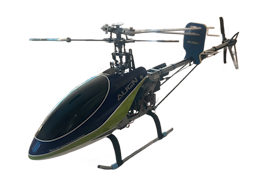

# Titan 450 SE V2

**Flybar Titan 450 SE V2** (Align SE V2-class clone) on a Radiomaster **TX16S MK3** (EdgeTX), bound to a FrSky **D8R-II Plus**.

Radio programming is a direct copy of [Align 450 SE V2](../Align%20450%20SE%20V2/Documentation/README.md) (curves, switches, CCPM). Only the **RF / receiver** side differs.

---

## At a glance

| Item | Detail |
|------|--------|
| Airframe | Titan 450 SE V2 (flybar, CCPM 120°) |
| Transmitter | TX16S MK3 · EdgeTX · slot **model1** |
| Receiver | FrSky **D8R-II Plus** (D8) |
| RF | **External** MULTI · **FrSky D → D8** (`subType: 3,0`) · 6 ch |
| Flight modes | Normal · Idle-Up 1 · Idle-Up 2 (**SE**) |
| Rates | Low · Medium · High (**SC**) |
| Hold | Throttle hold (**SF**) |
| Gyro gain | **SA** → CH5 |
| Lights | **SB** (RGB LED scripts) |
| Timer | **SD** |
| Pack | **3S** for flight · 2S OK for bench tune only |

---

## Docs

| Doc | What |
|-----|------|
| [RESTORE.md](RESTORE.md) | Drop SD pack onto the radio |
| [SETUP.md](SETUP.md) | Cheat sheet |
| [switch-map.md](switch-map.md) | Switches (same as Align) |
| [d8r-ii-plus-wiring.md](d8r-ii-plus-wiring.md) | CH1–6 → ESC / swash / gyro |
| [rf-bind-failsafe.md](rf-bind-failsafe.md) | Bind D8 + RX failsafe + fine-tune |
| [flight-modes-and-curves.md](flight-modes-and-curves.md) | Curves (from Align) |
| [flying-guide.md](flying-guide.md) | How to fly |
| [changelog.md](changelog.md) | Pack history |

Mechanics / levelling / yaw docs match the Align pack approach (same CCPM layout).

## SD pack

[`../SD Card Files/`](../SD%20Card%20Files/)
