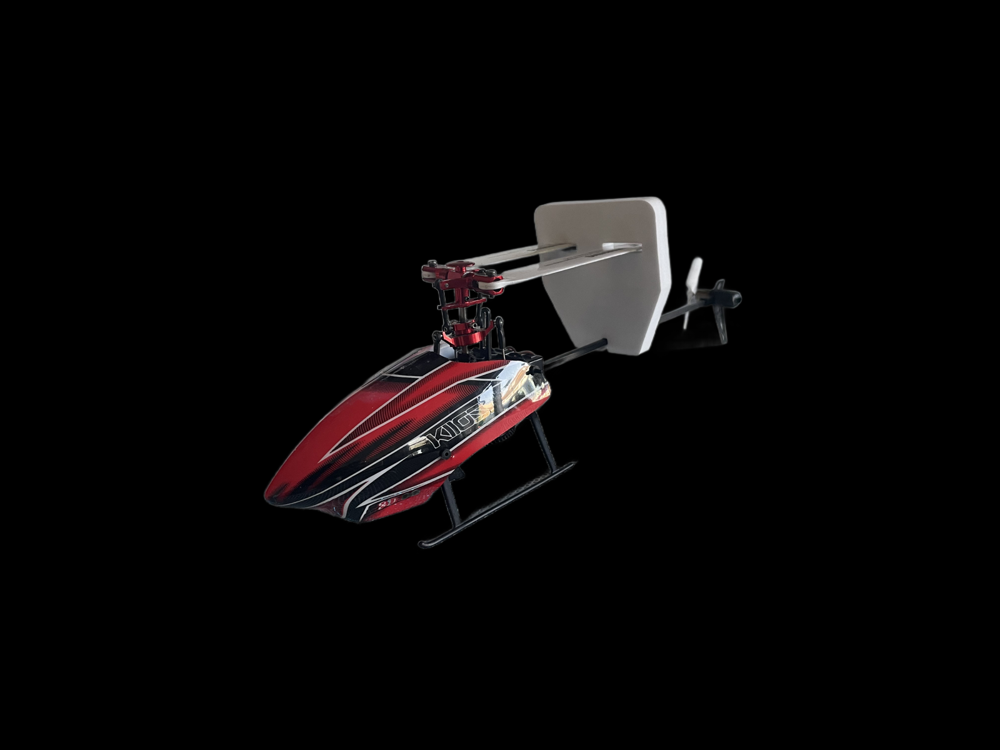

# XK K110S

**XK K110S** micro CP heli (FBL, S-FHSS) programmed on a Radiomaster **TX16S MK3** (EdgeTX, 4-in-1 MULTI). Radio model name: **XK 110s**.

This folder is the model’s documentation hub: switches, curves, RF, calibration order (gyro + 6G hover), flying, and how to restore the SD backup.

---

## At a glance

| Item | Detail |
|------|--------|
| Airframe | XK K110S (FBL — board mixes swash; radio swash = `---`) |
| Transmitter | TX16S MK3 · EdgeTX · Internal **MULTI → Futaba → SFHSS** |
| Freq fine-tune | **≈ +38** (`optionValue: 38` in `model4.yml`) |
| Channels | CH1 Ail · CH2 Ele · CH3 Thr · CH4 Rud · CH5 6G/3D (**SA**) · CH6 Col |
| Flight modes | Normal · Zero · Idle-Up (**SE**) |
| Rates | High / High / Low (**SC**) |
| 6G / 3D | **SA** → CH5 |
| Hold | Throttle hold (**SF**) |
| Lights | **SB** (`blue` / `red` / `off`) |
| Timer | **SD** |

---

## Documentation map

### Start here
| Doc | What’s in it |
|-----|----------------|
| **[Restore SD card files](RESTORE.md)** | Drop the backup onto the TX SD |
| **[Switch map & keybinds](switch-map.md)** | Every switch and what it does |
| **[Calibration order](calibration.md)** | Swash in 3D → gyro/sensor cal → **6G hover cal** |
| **[How to fly this model](flying-guide.md)** | Spool-up, hover, Idle-Up, safety |

### Radio setup
| Doc | What’s in it |
|-----|----------------|
| **[Flight modes & curves](flight-modes-and-curves.md)** | Normal / Zero / Idle-Up · CTN/CTI/CPN/CPI |
| **[Dual rates & expo](dual-rates-and-expo.md)** | SC High/High/Low |
| **[RF & binding](rf-and-binding.md)** | S-FHSS, fine-tune, failsafe |
| **[Heli / swash settings](swash-and-heli-setup.md)** | Why swash is `---` · channel map |

### Mechanics & tuning
| Doc | What’s in it |
|-----|----------------|
| **[Tuning & trim](tuning-and-trim.md)** | Links vs TX trim · left drift notes |
| **[Troubleshooting](troubleshooting.md)** | Symptoms → what to change |

### Reference
| Doc | What’s in it |
|-----|----------------|
| **[Setup summary](SETUP.md)** | Compact cheat sheet |
| **[Session changelog](changelog.md)** | What we decided in order |

---

## SD card backup

Droppable EdgeTX layout (merge onto SD root):

[`../SD Card Files/`](../SD%20Card%20Files/)

Includes `MODELS/model4.yml`, bitmap `XK110.png`, and RGBLED scripts used by **SB**. Screen gauges use built-in EdgeTX widgets.

---

## Safety reminders

1. **SF hold ON** until ready to spool.  
2. Take off and land in **Normal** + prefer **SC Low** while learning.  
3. Never flip Idle-Up from zero head speed with collective up.  
4. Do **not** chase hover with big ail/ele TX trim — level links in **3D**, then **6G hover cal**.  
5. After crashes / board swaps: calibration order in [calibration.md](calibration.md).

---

[← Back to repo home](../../../README.md)
