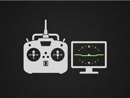

# Simulator

Minimal **TX16S MK3** profile for PC flight sims (USB / EdgeTX joystick). No RF — sticks at full range, plus **SB** for the radio RGB LEDs.

---

## At a glance

| Item | Detail |
|------|--------|
| Model | **Simulator** (`model7.yml`) |
| RF | **Off** (internal + external) |
| Sticks | Ail / Ele / Thr / Rud · **100%** · no dual rates / expo |
| LEDs | **SB** → blue / sapp / off (same RGBLED scripts as other packs) |
| Use | Select this model → plug USB → map axes in your sim |

---

## Docs

| Doc | What’s in it |
|-----|----------------|
| [RESTORE.md](RESTORE.md) | Drop onto SD |
| [SETUP.md](SETUP.md) | Cheat sheet |
| [switch-map.md](switch-map.md) | SB only |
| [changelog.md](changelog.md) | History |

## Related

- [← Repo README](../README.md)
